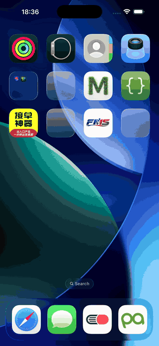

# ToastKit

ToastKit is a small SwiftUI toast presenter for iOS apps. It shows lightweight status messages in a separate `UIWindow`, supports blocking modal overlays, and lets users drag the toast up or down to dismiss it.

## Screenshots



## Requirements

- iOS 16.0+
- Swift 6.0+
- SwiftUI and UIKit
- Xcode with an iOS SDK

ToastKit builds with an iOS 16 deployment target. On newer SDKs it can use the modern glass surface branch when available, while older runtime versions fall back to a colored SwiftUI surface.

## Installation

Add ToastKit with Swift Package Manager:

```swift
dependencies: [
    .package(url: "https://github.com/Horse888/ToastKit.git", from: "1.0.0")
]
```

Then add `ToastKit` to your app target dependencies and import it where you present toasts:

```swift
import ToastKit
```

## Basic Usage

Show a built-in toast:

```swift
ToastKit.show(
    ToastInfo(type: .success, msg: "Saved"),
    duration: 3
)
```

Built-in success, warning, error, and loading toasts show a default SF Symbol automatically. On iOS 17 and later, the symbol also uses SwiftUI symbol effects when it appears; iOS 16 shows a static symbol.

Show an error:

```swift
ToastKit.showError("Something went wrong")
```

Hide the current toast manually:

```swift
ToastKit.hide()
```

Use `duration: 0` when the toast should stay visible until you hide it:

```swift
ToastKit.show(
    ToastInfo(type: .loading(.accentColor), msg: "Syncing..."),
    duration: 0
)
```

## Modal and Non-modal Modes

Non-modal mode is the default. The toast floats above your app and taps outside the toast continue to pass through to the underlying UI:

```swift
ToastKit.show(
    ToastInfo(type: .success, msg: "Copied"),
    isModal: false
)
```

Modal mode adds a dimming overlay and blocks interaction with the underlying UI:

```swift
ToastKit.show(
    ToastInfo(type: .warning, msg: "Please wait"),
    duration: 2,
    isModal: true
)
```

Both modes support drag interaction. Drag the toast up or down far enough to dismiss it. While the user is dragging, automatic dismissal pauses; if the drag is cancelled before the threshold, the timer resumes.

## Toast Types

```swift
ToastInfo(type: .success, msg: "Done")
ToastInfo(type: .warning, msg: "Network unstable")
ToastInfo(type: .error, msg: "Save failed")
ToastInfo(type: .loading(.blue), msg: "Uploading")
```

Default symbols:

- `.success`: `checkmark.circle.fill`
- `.warning`: `exclamationmark.triangle.fill`
- `.error`: `xmark.octagon.fill`
- `.loading`: `arrow.triangle.2.circlepath`

Override the SF Symbol for any built-in toast:

```swift
ToastKit.show(
    ToastInfo(
        type: .success,
        msg: "Added to favorites",
        sfSymbolName: "star.fill"
    )
)
```

Pass `nil` explicitly to hide the SF Symbol:

```swift
ToastKit.show(
    ToastInfo(type: .success, msg: "Saved", sfSymbolName: nil)
)
```

## Custom Content

You can present any SwiftUI view:

```swift
ToastKit.show(duration: 4, isModal: false) {
    HStack(spacing: 12) {
        Image(systemName: "icloud.and.arrow.up")
        VStack(alignment: .leading, spacing: 2) {
            Text("Upload complete")
                .font(.headline)
            Text("12 files were backed up")
                .font(.caption)
                .foregroundStyle(.secondary)
        }
    }
    .padding(.horizontal, 18)
    .padding(.vertical, 12)
    .background(.regularMaterial, in: Capsule())
}
```

ToastKit applies the presentation, drag, timer, and modal behavior. Your custom view controls its own layout and visual styling.

## Configuration

Configure the default `CommonToast` style once, usually at app startup:

```swift
ToastKit.configure(
    style: ToastStyle(
        successBackgroundColor: .green.opacity(0.14),
        warningBackgroundColor: .orange.opacity(0.14),
        errorBackgroundColor: .red.opacity(0.14),
        loadingBackgroundColor: .blue.opacity(0.14),
        foregroundColor: .primary,
        font: .system(size: 15, weight: .semibold),
        symbolFont: .system(size: 22, weight: .bold),
        horizontalPadding: 22,
        verticalPadding: 12,
        contentHorizontalPadding: 24,
        topPadding: 14,
        cornerRadius: 999,
        shadowRadius: 24,
        shadowY: 5,
        modalOverlayColor: .black.opacity(0.18),
        animationDuration: 0.3
    )
)
```

Available style options:

- Background colors for success, warning, error, and loading states
- Border colors for success, warning, error, and loading states
- Text color, text font, and SF Symbol font
- Horizontal and vertical content padding
- Top spacing and screen-edge padding
- Corner radius, border width, and shadow
- Modal overlay color
- Presentation animation duration

## Behavior Notes

- ToastKit presents from the best available foreground `UIWindowScene`.
- Showing a new toast replaces the current toast and resets the dismissal timer.
- `ToastKit.showError` logs the error message through `OSLog`.
- Non-modal mode only captures touches inside the toast hit area; the rest of the overlay window passes touches through.
- Drag dismissal reports `.dragUp` or `.dragDown` internally, and programmatic dismissal uses `.programmatic`.

## Development

Build the iOS package target from the command line:

```bash
swift build --sdk /path/to/iPhoneOS.sdk --triple arm64-apple-ios16.0
```

`swift test` is not the primary validation command for this package because ToastKit imports UIKit and is iOS-only; plain SwiftPM tests build for macOS by default.

## Demo App

Open the demo project in Xcode:

```bash
open Examples/ToastKitDemo/ToastKitDemo.xcodeproj
```

Select the `ToastKitDemo` scheme, choose an iOS simulator, and run it. The demo automatically plays a short toast showcase on launch and also includes manual buttons for each toast type.

To build it from the command line:

```bash
xcodebuild \
  -project Examples/ToastKitDemo/ToastKitDemo.xcodeproj \
  -scheme ToastKitDemo \
  -destination 'platform=iOS Simulator,name=iPhone 17 Pro Max' \
  -configuration Debug \
  build
```

To record a GIF:

```bash
xcrun simctl io booted recordVideo /tmp/toastkit-demo.mov
```

Launch the demo while recording, stop recording with `Control-C`, then convert it:

```bash
ffmpeg -y -i /tmp/toastkit-demo.mov \
  -vf 'fps=12,scale=320:-1:flags=lanczos,split[s0][s1];[s0]palettegen=max_colors=96[p];[s1][p]paletteuse=dither=bayer:bayer_scale=5' \
  Documentation/Images/toastkit-demo.gif
```

## License

ToastKit is available under the MIT license. See `LICENSE` for details.
